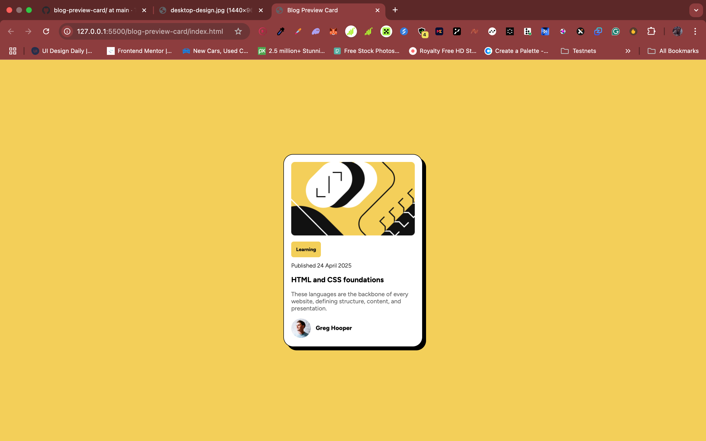

# Blog Preview Card

This is a solution to the **Blog Preview Card** challenge on [Frontend Mentor](https://www.frontendmentor.io). It focuses on building a responsive card layout using only HTML and CSS.

## 🖼️ Screenshot



## 📍 Live Site

👉 [View live project](https://tanimhrn.github.io/blog-preview-card)

## 🚀 Built With

- Semantic **HTML5**
- **CSS3** (custom styling)
- Flexbox for layout
- Mobile-first workflow

## 🧠 What I Learned

- How to structure HTML for better semantics and accessibility
- Using `display: inline-block` and `fit-content` to size boxes to content
- Centering elements vertically and horizontally with Flexbox
- Styling reusable UI components
- Handling shadows with `box-shadow`, including one-sided shadows and `inset`

## 💡 Features

- Fully responsive design
- Smooth hover effects
- Clean layout based on real-world UI

## 📁 Project Setup

To run locally:

```bash
git clone https://github.com/Tanimhrn/blog-preview-card.git
cd blog-preview-card
open index.html
